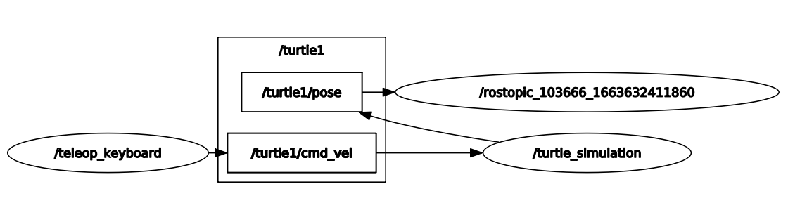

# robotics-lab3
Connection to ROS with matlab and teleop keys.

> ## Contributors
> 
> - [Camilo Andrés Borda Gil](https://github.com/Canborda) (caabordagi@unal.edu.co)
> - Paula Sofía Medina Diaz (psmedinadi@unal.edu.co)
> - Robinson Jair Orduz Gomez (rjorduzg@unal.edu.co)

---
# INTRODUCTION TO ROS

This repository presents a friendly introduction to ROS and the usage of the main *[ROS Graph Concepts](http://wiki.ros.org/ROS/Concepts)* like nodes, topics, services, pusblishers and subscribers; based on the classic [turtlesim package](http://wiki.ros.org/turtlesim). We also present the basics of ROS connection with the [MATLAB ROS Toolbox](https://www.mathworks.com/help/ros/ug/get-started-with-ros.html) as an alternative to connect and use all the ROS features.

---
## How to Use the Package

The first thing to do is to clone this repository (inside your catkin workspace) and build the package for ROS:

```
git clone https://github.com/Canborda/robotics-lab3.git
catkin build robotics-ros-1-introduction
source devel/setup.bash
```

Now just launch the package with the following command:
```
roslaunch robotics-ros-1-introduction turtle.launch
```
And that's it ! now you should have running two nodes:
- `/turtle_simulation`: visualization of the __tustlesim__ package.
- `/teleop_keyboard`: node that publishes the linear and angular velocity or teleports to the __turtlesim__ topics, when the corresponding keys are pressed.

---
# The Turtlesim Package

ROS noetic has a builted-in demo package called [turtlesim](http://wiki.ros.org/turtlesim) that starts a node with a visualization window and is subscribed to a different topics in order to move the turtle on it.

The topics used for this package were:
- `/turtle1/cmd_vel`: to control the linear and angular velocity.
- `/turtle1/pose`: to monitor turtle's position.

Also we used two services:
- `/turtle1/teleport_absolute`: to re-spawn the turtle on the initial point.
- `/turtle1/teleport_relative`: to rotate the turtle 180 degrees with respect to its current position.

---
# ROS on Python

The presented solution uses the keyboard listener of the [pynput library](https://pynput.readthedocs.io/en/latest/keyboard.html#monitoring-the-keyboard) to listen for the keys: `W`, `A`, `S`, `D`, `R` and `Space`, and depending on the pressed key publishes a message on the corresponding topic.

- For linear velocity `W`/`S` keys increase or decrease the value with a rate of 1, and the limit value is 10 (forward or backward).
- For angular velicity `A`/`D` keys increase or decrease the value with a rate of 1, and the limit value is 10 (clockwise or counterclockwise).

When the `/teleop_keyboard` node is publishing messages, the ROS graph looks like this (the node with the long name is a temporary node created with the `rostopic echo /turtle1/pose` command to monitor the turtle pose):

<p align="center"></p>